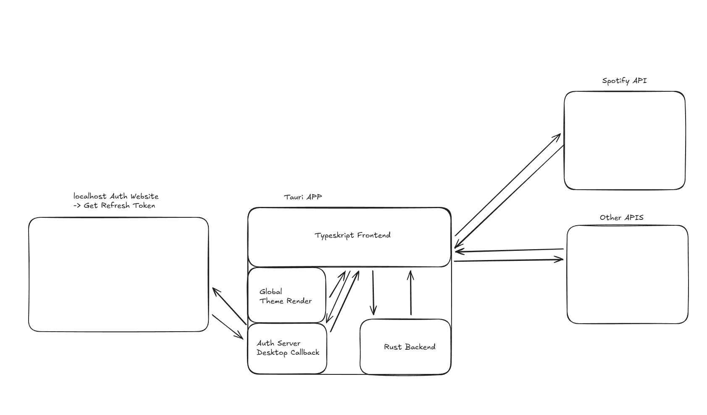
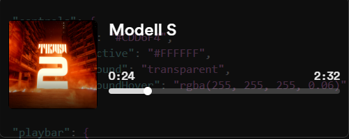
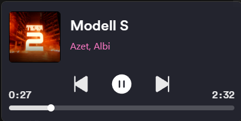
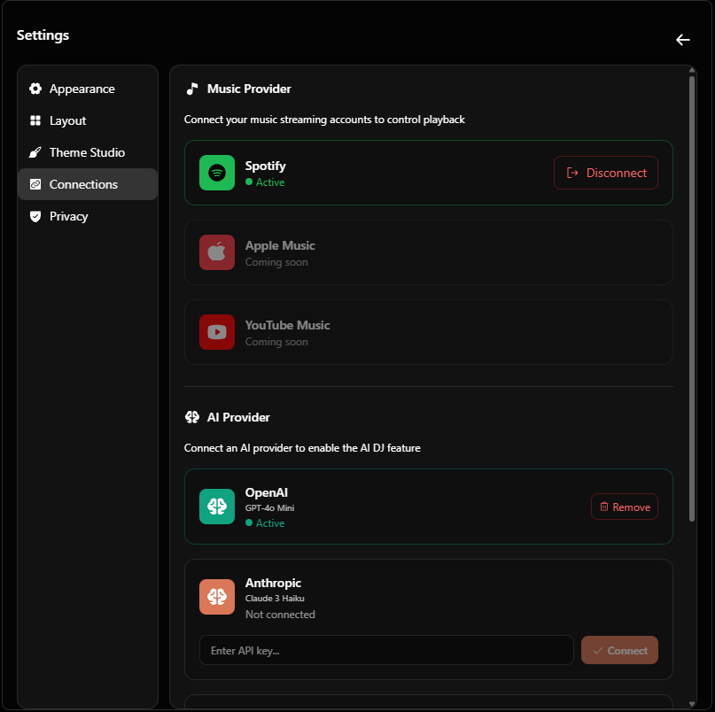
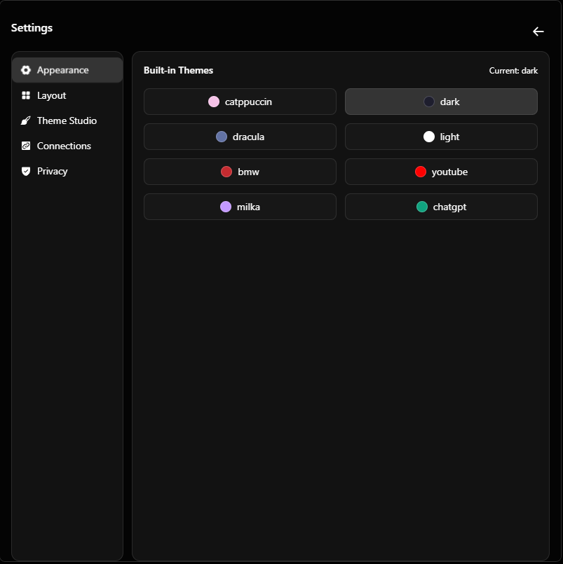
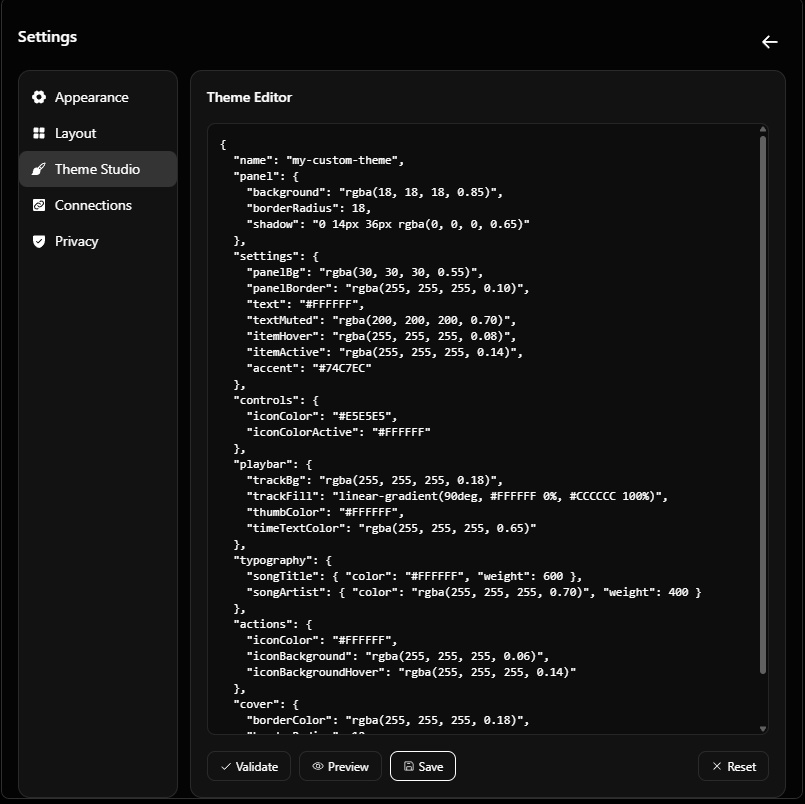

  
  <h1>MiniFy</h1>
  
Spotify mini player for desktop built with Tauri + React, paired with a Next.js landing site.

  

    <a href="https://minify.skeptic.run"><strong>🌐 Website</strong></a>
    ·
    <a href="https://minify-docs.skeptic.run"><strong>📚 Documentation</strong></a>
    ·
    <a href="https://github.com/ModioStudio/MiniFy/releases/latest"><strong>⬇️ Download</strong></a>
  

  

    <a href="https://github.com/ModioStudio/MiniFy/issues/new?labels=bug">Report Bug</a>
    ·
    <a href="https://github.com/ModioStudio/MiniFy/issues/new?labels=enhancement">Request Feature</a>
    ·
    <a href="https://github.com/orgs/ModioStudio/projects/2">Project Board</a>
  

  

    
    
    
    
    
    
    
    
    
    
    
  

## Table of Contents
- [Overview](#overview)
- [Features](#features)
  - [Core Player](#-core-player)
  - [Customization](#-customization)
  - [AI DJ](#-ai-dj)
  - [Security](#-security)
- [Screenshots](#screenshots)
  - [Player Layouts](#-player-layouts)
  - [AI DJ Integration](#-ai-dj-integration)
  - [Settings & Customization](#️-settings--customization)
- [Architecture](#architecture)
- [Getting Started](#getting-started)
- [Scripts](#scripts)
- [Tech Stack](#tech-stack)
- [Security Details](#security-details)
- [Links](#links)
- [License](#license)

## Overview
MiniFy is a lightweight Spotify mini player built with Tauri. It lives as a frameless desktop overlay, polls the Spotify API for the currently playing track, and gives you playback controls, themeable layouts, and native OS menus. A Next.js site lives alongside the desktop app for marketing and downloads.

## Features

### 🎧 Core Player
- Spotify OAuth flow with secure token storage and automatic refresh
- Playback controls, scrubbing, and save-to-library actions
- Native context menu with quick access to settings and window controls
- Keyboard-friendly design with configurable shortcuts

### 🎨 Customization
- **Multiple Layouts**: Three player layouts (A, B, C) optimized for different workflows
- **Built-in Themes**: Dark, Light, Spotify Green, and more pre-built themes
- **Theme Studio**: Create custom themes with a live JSON editor
- **Persistent Settings**: Your preferences are saved and restored automatically

### 🤖 AI DJ
- **Multi-Provider Support**: OpenAI, Anthropic, Google AI, and Groq
- **Music Analysis**: Understands your listening patterns, top artists, and audio preferences
- **Natural Language Control**: "Play something energetic" or "Find songs like my recent listens"
- **Smart Recommendations**: Uses Spotify's audio features (energy, mood, tempo, danceability)

### 🔐 Security
- **Secure Keyring Storage**: All credentials stored in OS-level credential manager
- **No Plain Text**: API keys and tokens never saved to files
- **OAuth PKCE**: Industry-standard secure authentication flow

## Roadmap
- Follow progress and planned milestones on the project board: [ModioStudio MiniFy Roadmap](https://github.com/orgs/ModioStudio/projects/2)

## Architecture
- Tauri shell hosting a Vite + React UI for the player.
- Rust commands manage OAuth, secure keyring storage, and Spotify Web API calls.
- All credentials (Spotify tokens, AI API keys) stored in OS-level secure keyring.
- AI DJ powered by Vercel AI SDK with tool-calling for Spotify integration.
- Shared settings persisted on disk; playback state is polled and cached in the renderer.
- Optional Next.js 15 site for the public landing page.

  

## Screenshots

### 🎵 Player Layouts

MiniFy offers multiple compact layouts to fit your workflow. Each layout is designed to be minimal yet functional.

  
<b>Layout A</b> — Horizontal compact view

  

    
  

  
<b>Layout B</b> — Vertical card view

  

    
  

---

### 🤖 AI DJ Integration

Your personal AI-powered music assistant. Connect your preferred AI provider and let it analyze your listening habits, recommend songs, and control playback through natural conversation.

  
<b>AI DJ Chat</b> — Natural language music control

  

    
  

  
<i>Ask for recommendations, play songs, or analyze your music taste</i>

  
<b>AI DJ Preview</b> — Context menu access

  

    
  

**Supported AI Providers:**
- OpenAI (GPT-4o Mini)
- Anthropic (Claude 3 Haiku)
- Google AI (Gemini 1.5 Flash)
- Groq (Llama 3.1 8B)

---

### ⚙️ Settings & Customization

Full control over your MiniFy experience through a comprehensive settings panel.

  
<b>Connections</b> — Music & AI Provider Management

  

    
  

  
<i>Connect Spotify and AI providers with secure API key storage</i>

  
<b>Appearance</b> — Layouts & Built-in Themes

  

    
  

  
<i>Choose from multiple layouts and pre-built themes</i>

  
<b>Theme Studio</b> — Create Custom Themes

  

    
  

  
<i>Design your own themes with the built-in JSON editor</i>

**Customization Features:**
- 🎨 Multiple built-in themes (Dark, Light, Spotify Green, etc.)
- 🖌️ Custom theme creation via JSON
- 📐 Switchable player layouts
- 🔐 Secure credential management

## Project Structure
- `apps/desktop`: Tauri 2 desktop app using React 19, Vite 7, and Tailwind 4.
- `apps/www`: Next.js 15 site for marketing and downloads.
- `packages` (empty today): reserved for future shared libraries.
- Root tooling: Turborepo orchestrates tasks, Biome handles lint/format, pnpm powers the workspace.

## Getting Started

### Prerequisites
- Node.js >= 18 and pnpm 9.
- Rust toolchain with the platform-specific Tauri prerequisites.
- Spotify Developer application to obtain a Client ID.

### Setup
1. Install dependencies: `pnpm install`
2. (Optional) Install Git hooks: `pnpm dlx lefthook install`
3. Have your Spotify Client ID ready; the desktop app will ask for it on first launch.

### Running Locally
- Desktop app: `pnpm desktop:dev`
  - First boot asks for the Spotify Client ID, performs OAuth, and lets you pick layout/theme.
- Web site: `pnpm www:dev`
  - Starts the Next.js site (default port 3000).

## Scripts
- `pnpm dev` — run workspace dev tasks via Turborepo.
- `pnpm desktop:dev` — launch the Tauri app in dev mode.
- `pnpm desktop:build` — create a production desktop bundle.
- `pnpm desktop:clear` — clear all credentials (Spotify tokens, AI keys) and settings.
- `pnpm www:dev` — start the Next.js site.
- `pnpm www:build` — build the Next.js site.
- `pnpm lint` — run Biome checks across the workspace.

## Tech Stack
- Desktop: Tauri 2, React 19, Vite 7, Tailwind CSS 4, Spotify Web API.
- AI: Vercel AI SDK with OpenAI, Anthropic, Google AI, and Groq support.
- Backend bridge: Rust + Tauri commands for OAuth, secure keyring storage, and playback actions.
- Web: Next.js 15 with React 19.
- Tooling: Turborepo, pnpm, Biome, Lefthook.

## Security Details
All sensitive credentials are stored in your operating system's secure credential manager:

| Platform | Storage |
|----------|---------|
| Windows | Credential Manager |
| macOS | Keychain |
| Linux | Secret Service |

This includes Spotify tokens and AI API keys. No credentials are stored in plain text files.

## Links

| Resource | URL |
|----------|-----|
| 🌐 Website | [minify.skeptic.run](https://minify.skeptic.run) |
| 📚 Documentation | [minify-docs.skeptic.run](https://minify-docs.skeptic.run) |
| ⬇️ Downloads | [GitHub Releases](https://github.com/ModioStudio/MiniFy/releases/latest) |
| 🐛 Issues | [GitHub Issues](https://github.com/ModioStudio/MiniFy/issues) |
| 📋 Roadmap | [Project Board](https://github.com/orgs/ModioStudio/projects/2) |

## License
Licensed under the MIT License. See `LICENSE` for details.