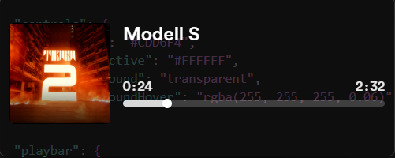
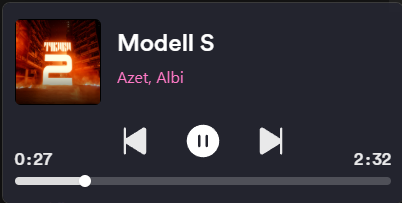
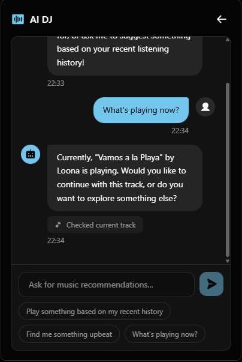
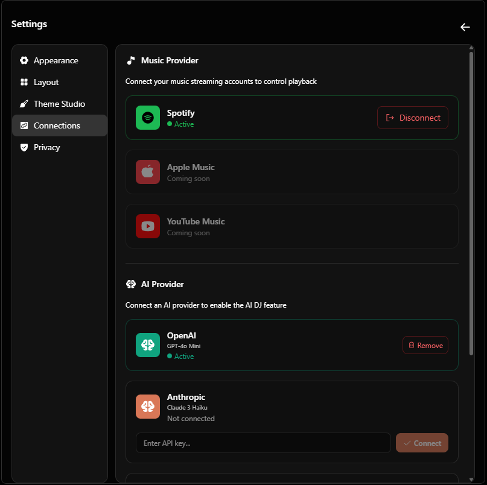
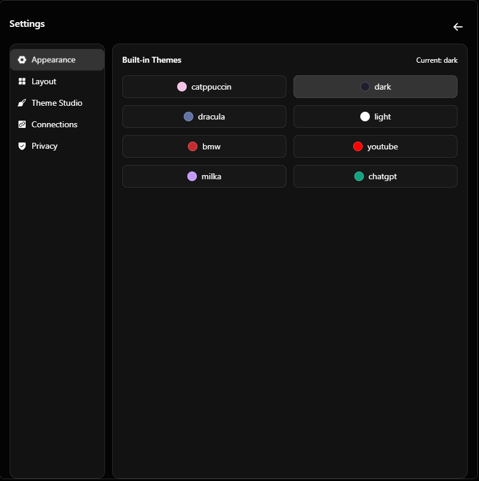
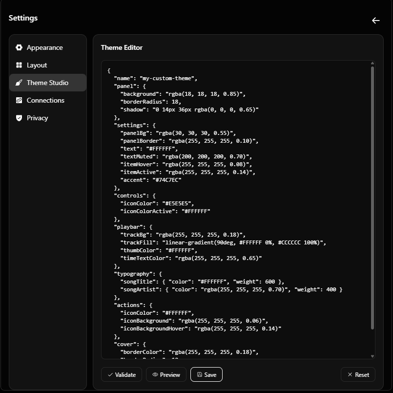

<div align="center">
  
  <h1>MiniFy</h1>
  <p>A lightweight desktop mini player for Spotify, built with Tauri, React, and Rust.</p>
  <p>
    <a href="https://minify.skeptic.run"><strong>Website</strong></a>
    ·
    <a href="https://minify-docs.skeptic.run"><strong>Docs</strong></a>
    ·
    <a href="https://github.com/ModioStudio/MiniFy/releases/latest"><strong>Download</strong></a>
  </p>
  <p>
    
    
    
    
  </p>
</div>

## Overview

MiniFy is a compact Spotify companion for the desktop. It runs as a native
Tauri app, shows the current track in small always-available layouts, and keeps
playback controls, settings, themes, and AI-assisted recommendations close at
hand.

The repository also contains the public website and documentation site.

## Features

- Spotify OAuth PKCE login with automatic token refresh
- Secure OS keyring storage for Spotify tokens and AI provider keys
- Compact player layouts with playback controls, progress, and track metadata
- Built-in themes plus a JSON-based Theme Studio for custom themes
- AI DJ chat for recommendations and playback-aware music prompts
- Provider settings for Spotify, YouTube Music, and AI services
- Native desktop shell powered by Tauri and Rust

## Architecture

- `apps/desktop`: Tauri 2 desktop app with React, Vite, Tailwind CSS, and Rust.
- `apps/www`: Next.js site for the project website and downloads.
- `apps/docs`: Astro Starlight documentation site.
- Rust commands handle OAuth, local callback handling, keyring access, settings,
  and desktop integration.
- The renderer talks to Spotify and AI providers through typed clients and
  Tauri commands.

## Getting Started

### Prerequisites

- Node.js `>=20.19.0`
- pnpm `10.26.2`
- Rust toolchain with the platform-specific Tauri prerequisites
- Spotify Developer app Client ID for local development builds

### Setup

```bash
pnpm install
```

### Development

```bash
pnpm desktop:dev
pnpm www:dev
pnpm docs:dev
```

On first desktop launch, MiniFy asks for a Spotify Client ID and starts the
browser-based OAuth flow.

## Scripts

| Command | Description |
| --- | --- |
| `pnpm desktop:dev` | Start the Tauri desktop app |
| `pnpm desktop:build` | Build the desktop app |
| `pnpm desktop:clear` | Clear desktop credentials and settings |
| `pnpm www:dev` | Start the Next.js website |
| `pnpm docs:dev` | Start the documentation site |
| `pnpm lint` | Run workspace Biome checks |
| `pnpm test` | Run the Oxlint quality gate |
| `pnpm format` | Format with Biome |

## Security

MiniFy does not store Spotify tokens or AI API keys in plain text files.
Credentials are kept in the operating system credential store:

| Platform | Storage |
| --- | --- |
| Windows | Credential Manager |
| macOS | Keychain |
| Linux | Secret Service |

Spotify authentication uses OAuth 2.0 with PKCE. Desktop/open-source builds
must not embed a Spotify Client Secret.

## Links

- Website: [minify.skeptic.run](https://minify.skeptic.run)
- Documentation: [minify-docs.skeptic.run](https://minify-docs.skeptic.run)
- Releases: [GitHub Releases](https://github.com/ModioStudio/MiniFy/releases/latest)
- Issues: [GitHub Issues](https://github.com/ModioStudio/MiniFy/issues)
- Roadmap: [Project Board](https://github.com/orgs/ModioStudio/projects/2)
- Discord: [discord.gg/haNyuz2zQ5](https://discord.gg/haNyuz2zQ5)

## Screenshots

|  |  |
| :---: | :---: |
| <br>**Compact Player**: horizontal overlay with cover art, track metadata, progress, and time | <br>**Card Player**: larger controller layout with prominent transport controls |
| <br>**AI DJ**: chat-based music assistant that can inspect playback and suggest tracks | <br>**Connections**: manage music providers and AI provider credentials in one place |
| <br>**Themes**: switch between built-in visual styles from the settings screen | <br>**Theme Studio**: edit, validate, preview, and save custom JSON themes |


## License

Licensed under the MIT License. See [LICENSE](./LICENSE) for details.
